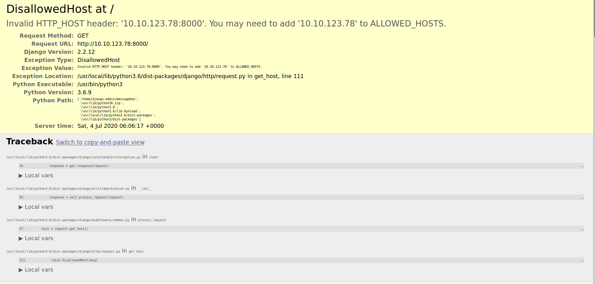
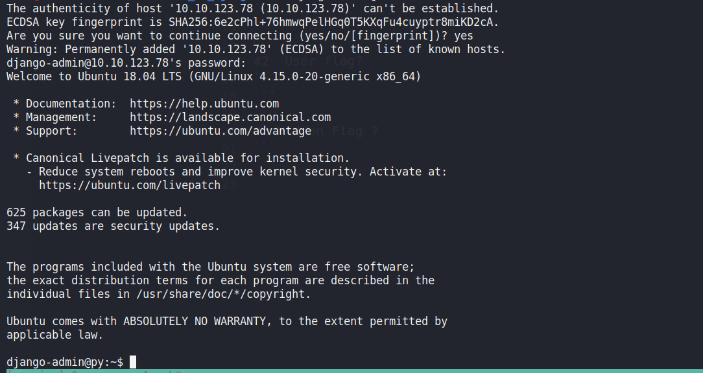
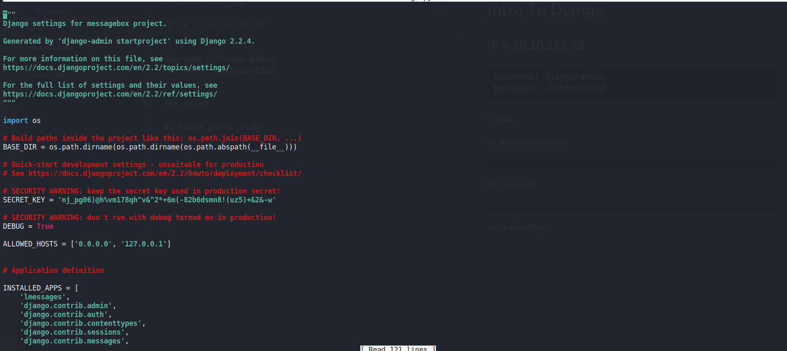
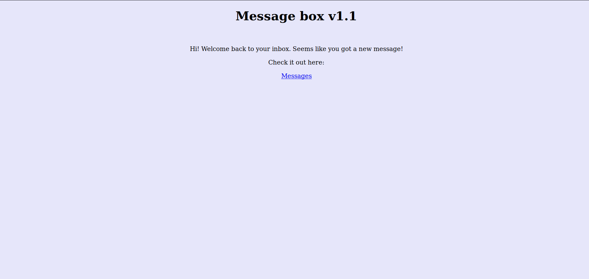
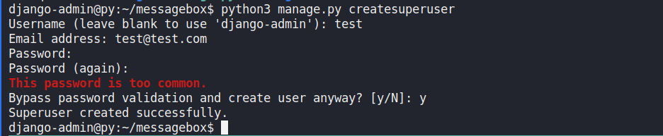
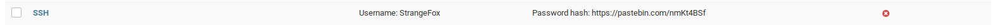
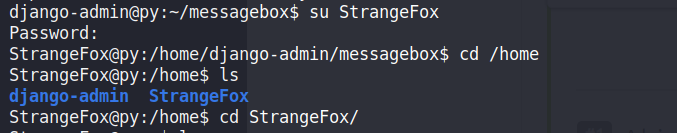

# Intro To Django

[Tryhackme Intro To Django](https://tryhackme.com/room/django)

```
Username: django-admin
Password: roottoor1212
```

### Task5

#1 Admin panel flag?
```
nmap results show a webserver on port 8000 on navigating there we see
```


```
According to above article the host has not been added so we ssh into the machine as ssh was also open in the machine according to our nmap scans
```

`ssh django-admin@<machine_ip>`

```
and then supply the above password we see we are django-admin user
```


```
listing all directories we can see a messagebox directory cd messagebox/ and then again cd to messagebox here we can see a seetings.py file
```


```
nano settings.py and add the machine ip in the place of 127.0.0.1 and save the file now on accessing the page we can see the website live 
```


```
Nothing seemed interesting here so I decided to navigate to /admin section there on entering the above username password we get an error message
so I decided to create a new superuser
```
`python3 manage.py createsuperuser`
```
you should be in the directory where manage.py is present
```


```
Now acessing the admin section we can log in on searching I was able to find the first flag
Below that I also saw another user whose password was present in the pastebin
```


[CrackStation](https://crackstation.net/)
``` 
Taking that password hash and cracking it in crackstation we get the password. then on switching user we can now become strangeFox
```



#2  User flag? 
```
on strange fox's home directory we can find the user.txt flag
```

#3 Hidden Flag ?
```
on some searching I found the third flag in /messagebox/messagebox/home.html
```
 